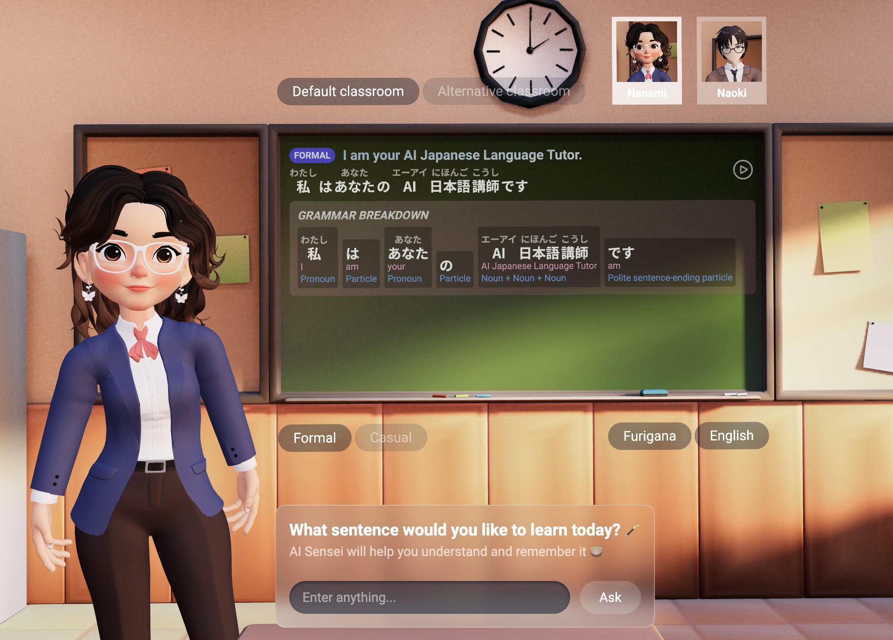

# AI Sensei - Your 24/7 Japanese Language Tutor 🌸 🍵

<div align="center">
  <h3>Learn Japanese with an AI-powered 3D teacher that adapts to your learning style!</h3>
</div>

<div align="center">
  
</div>


**AI Sensei** is an innovative Next.js application that combines AI technology with immersive 3D visualization to create a unique Japanese language learning experience. Whether you're a beginner or advanced learner, AI Sensei provides real-time translations, grammar breakdowns, and pronunciation guidance with a personalized touch. 📚


<p align="center">
  📍 <a href="https://ai-sensei-japanese-tutor-u27615.vm.elestio.app/"><strong>AI Sensei - Live Demo</strong></a> 📍
</p>


## ✨ Key Features

- **Interactive 3D Teachers**: Choose between different 3D teacher models with unique voice and personalities 🧚
- **Real-time AI Translation**: Powered by OpenAI's GPT for accurate translations and explanations 🔍
- **Text-to-Speech**: Native Japanese pronunciation using Azure's Speech Services 💬
- **Grammar Breakdown**: Detailed analysis of sentence structure and usage 👩🏻‍🏫
- **Dual Learning Modes**: Switch between formal and casual Japanese 🌊
- **Furigana Support**: Optional reading aids for kanji characters 🪄

## 🛠️ Technology Stack

- **Frontend**: Next.js 14, React Three Fiber, Drei
- **3D Rendering**: Three.js
- **AI Integration**: OpenAI GPT-3.5
- **Speech Synthesis**: Microsoft Cognitive Services
- **State Management**: Zustand
- **Styling**: Tailwind CSS

## 🚀 Getting Started

### Prerequisites

- Node.js
- npm/yarn/pnpm
- OpenAI API Key
- Azure Speech Services Key

### Installation

1. **Clone the repository**:
```bash
git clone https://github.com/yourusername/ai-sensei.git
cd ai-sensei
```

2. **Install dependencies**:
```bash
npm install
```

3. **🔔 IMPORTANT: Set up your own environment variables**:

Create a `.env.local` file at the root directory:
```env
OPENAI_API_KEY=your_openai_key
SPEECH_KEY=your_azure_speech_key
SPEECH_REGION=your_azure_region
```

4. **Start the development server**:
```bash
npm run dev
```

Visit `http://localhost:3000` to see the application.

## 🎯 Usage

The main interface consists of:

1. **Teacher Selection**: Choose between Nanami and Naoki as your virtual sensei
2. **Classroom Environment**: Select between default and alternative classroom settings
3. **Learning Mode**: Toggle between formal and casual Japanese
4. **Input Box**: Type any English phrase you want to learn in Japanese
5. **Grammar Board**: View detailed breakdowns of sentence structure
6. **Pronunciation**: Listen to native pronunciation with lip-sync animation

## 📦 Project Structure

Key components:

- **Experience.jsx**: Main 3D scene setup and rendering
- **Teacher.jsx**: 3D teacher model with animations and lip-sync
- **MessagesList.jsx**: Displays conversation history and grammar explanations
- **TypingBox.jsx**: User input interface
- **useAITeacher.js**: Central state management with Zustand

## 🔒 Environment Variables

Required environment variables:
```env
OPENAI_API_KEY=your_openai_api_key
SPEECH_KEY=your_azure_speech_key
SPEECH_REGION=your_azure_region
```

## 🤝 Contributing

Contributions are welcome! Please feel free to submit a Pull Request.

## 📄 License

This project is licensed under the MIT License - see the LICENSE file for details.

## 🙏 Acknowledgments

- OpenAI for GPT integration
- Microsoft Azure for Speech Services
- Three.js community for 3D rendering support
- Next.js team for the framework
